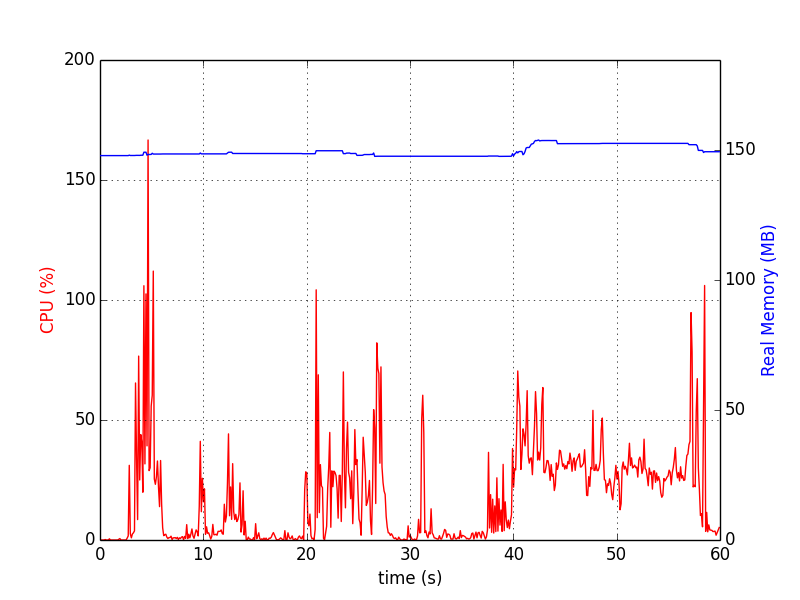

 

About
=====

``psrecord`` is a small utility that uses the
[psutil](https://code.google.com/p/psutil/) library to record the CPU and
memory activity of a process. The package is still under development and is
therefore experimental.

The code is released under a Simplified BSD License, which is given in the
``LICENSE`` file.

Requirements
============

* Python 2.x or 3.x
* [psutil](https://code.google.com/p/psutil/)
* [matplotlib](http://www.matplotlib.org) (optional, used for plotting)

Installation
============

To install:

    git clone https://github.com/astrofrog/psrecord
    cd psrecord
    python setup.py install

Usage
=====

Basics
------

To record the CPU and memory activity of an existing process to a file:

    psrecord 1330 --log activity.txt

where ``1330`` is an example of a process ID which you can find with ``ps`` or
``top``. You can also use ``psrecord`` to start up a process by specifying the
command in quotes:

    psrecord "hyperion model.rtin model.rtout" --log activity.txt

Plotting
--------

To make a plot of the activity:

    psrecord 1330 --plot plot.png

This will produce a plot such as:

You can combine these options to write the activity to a file and make a plot
at the same time:

    psrecord 1330 --log activity.txt --plot plot.png

Duration and intervals
----------------------

By default, the monitoring will continue until the process is stopped. You can
also specify a maximum duration in seconds:

    psrecord 1330 --log activity.txt --duration 10

Finally, the process is polled as often as possible by default, but it is
possible to set the time between samples in seconds:

    psrecord 1330 --log activity.txt --interval 2

Subprocesses
------------

To include sub-processes in the CPU and memory stats, use:

    psrecord 1330 --log activity.txt --include-children

Reporting issues
================

Please report any issues in the
[issue tracker](https://github.com/astrofrog/psrecord/issues).
